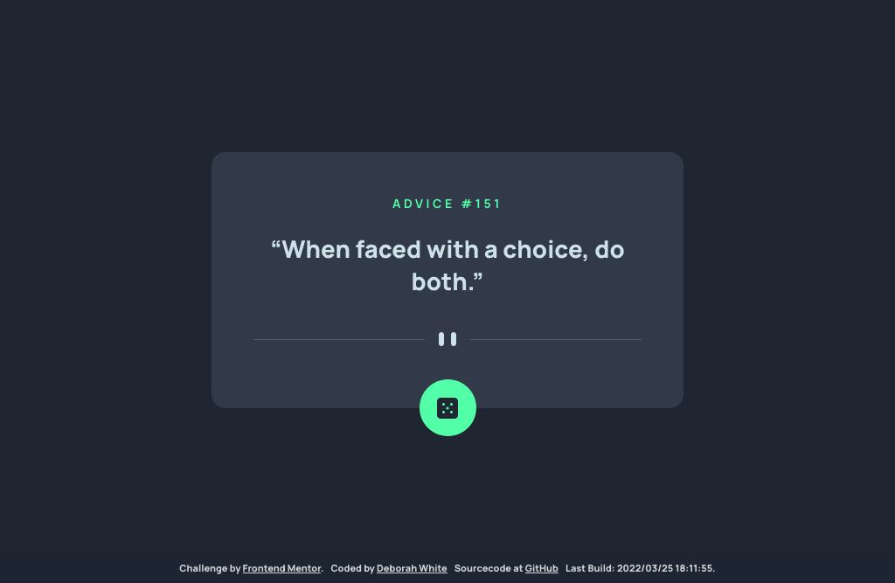

# Frontend Mentor - Advice generator app solution

This is a solution to the [Advice generator app challenge on Frontend Mentor](https://www.frontendmentor.io/challenges/advice-generator-app-QdUG-13db). Frontend Mentor challenges help you improve your coding skills by building realistic projects.

## Table of contents

- [Overview](#overview)
    - [The challenge](#the-challenge)
    - [Screenshot](#screenshot)
    - [Links](#links)
- [My process](#my-process)
    - [Built with](#built-with)
    - [What I learned](#what-i-learned)
    - [Continued development](#continued-development)
    - [Useful resources](#useful-resources)
- [Author](#author)

## Overview

### The challenge

Users should be able to:

- View the optimal layout for the app depending on their device's screen size
- See hover states for all interactive elements on the page
- Generate a new piece of advice by clicking the dice icon

### Screenshot

### Links

- Solution URL: [Source code on GitHub](https://github.com/gelbehexe/frontend-mentor-advice-generator-app)
- Live Site URL: [My live page on a server](https://frontend-mentor-advice-generator-gelbehexe.netlify.app/)

## My process

### Built with

- Semantic HTML5 markup
- CSS
    - custom properties
    - Flexbox
- Mobile-first workflow
- [Vue3](https://vuejs.org/) - Vue JavaScript Framework
- [Sass](https://sass-lang.com/) - Sass stylesheet language
- [JavaScript](https://developer.mozilla.org/en-US/docs/Web/JavaScript/Reference) - JavasScript language
- [webpack](https://webpack.js.org/) - Static module bundler
- [HtmlWebpackPlugin](https://github.com/jantimon/html-webpack-plugin/blob/main/README.md) - HTML file creator (webpack plugin)
- [postcss](https://postcss.org/) - CSS transformer with JavScript
- [faker](https://github.com/faker-js/faker) - A library for generating faked data
- [eslint](https://eslint.org/) - Static code analyzer
- [stylelint](https://stylelint.io/) - Static code analyzer for css/scss
- [prettier](https://prettier.io/) - An opinionated code formatter
- [babel](https://babeljs.io/) - JavaScript compiler

### What I learned

I learned a lot, e.g.
- How to provide data generated while build (buildTime) provide to app
- Fake data via faker and enable usage to avoid fetching data, enabling and disabling it via dotEnv at build time 
  while avoiding including it in bundle when not enabled
- Implement an animation when new advice was requested

### Continued development

I tried a few proofs of concept while developing (e.g. conditional including a package depending on settings in .env)
I'm happy, that I know now how to do these things and will use them in future for real projects.

### Useful resources

- [CSS-Tricks](https://css-tricks.com/) - Tips, Tricks, and Techniques on using Cascading Style Sheets.

## Author

- Frontend Mentor - [@gelbehexe](https://www.frontendmentor.io/profile/gelbehexe)
